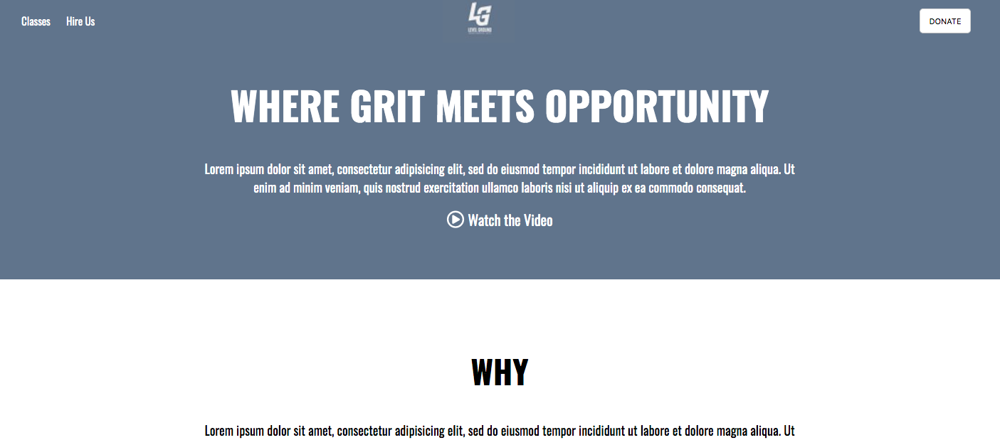

# My Project
Another repository showcasing recreations of I've made of already exciting websites.

## How It's Made:

**Tech used:** HTML and CSS

I started off with printing out images of the original websites and outlining what the sections, headers, navs, footer, etc, might be and then proceeded to build out the wireframe in HTML. I then started on the CSS and gave everything a border to help visualize the positioning of the elements only using floats, margins, padding, etc. I finished off each website by adding in special fonts, colors, and images if needed.

## Lessons Learned:

Some important takeaways from working on this series was learning about making layouts responsive through media queries, semantic HTML, specificity, pseudo-selectors, properties and values.
